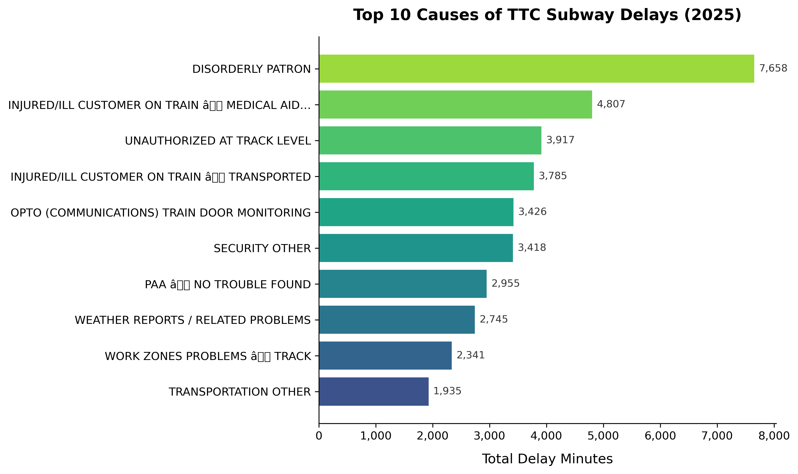

# Visualization 1: Top 10 Causes of TTC Subway Delays

## What software did you use to create your data visualization?

This visualization was created using **Python 3** with **matplotlib** for the chart and **pandas** for data processing. The code runs in a Jupyter Notebook environment, which allows for inline rendering and iterative development.

## Who is your intended audience?

The primary audience is **TTC management and City of Toronto transit planners** who allocate resources for infrastructure maintenance. A secondary audience is **Toronto commuters** who want to understand what disrupts their daily subway service.

## What information or message are you trying to convey with your visualization?

This horizontal bar chart ranks the top 10 causes of TTC subway delays by **total accumulated delay minutes** in 2025. It reveals which issues create the most cumulative disruption to the system — highlighting that a small number of causes are responsible for the majority of lost service time. This framing shifts the focus from individual incidents to systemic impact.

## What aspects of design did you consider when making your visualization? How did you apply them?

- **Pre-attentive processing**: The bars are sorted by magnitude so the viewer's eye naturally reads from most to least impactful.
- **Data-ink ratio**: Removed top and right spines to reduce chart junk (Tufte, 1983).
- **Direct labeling**: Numeric values appear at the end of each bar, eliminating the need to cross-reference against the x-axis.
- **Color**: Used a **viridis** sequential palette, which encodes magnitude and is perceptually uniform (Crameri et al., 2020).
- **Typography**: Descriptive labels are kept under 45 characters to prevent clutter, and the title clearly states the dataset and time period.

## How did you ensure that your data visualizations are reproducible?

All code is contained in a single Jupyter Notebook (`assignment_3_code.ipynb`) that fetches data directly from the City of Toronto's Open Data API. Running the notebook end-to-end on any machine with Python and an internet connection will reproduce the exact same visualization. The random seed is not needed here since no random generation is involved — the data pipeline is fully deterministic.

## How did you ensure that your data visualization is accessible?

- The **viridis** colormap remains distinguishable under the three most common forms of color vision deficiency (deuteranopia, protanopia, tritanopia).
- All text uses high-contrast dark gray (#333) on a white background, exceeding **WCAG AA** contrast requirements.
- Direct bar labels provide access to the exact values without relying solely on spatial position.
- A descriptive title and axis label give screen-reader users meaningful context.

## Who are the individuals and communities who might be impacted by your visualization?

Daily TTC riders — particularly those commuting to essential jobs from **underserved neighbourhoods** with limited transit alternatives — are most affected by delay causes. If decision-makers use this visualization to prioritize maintenance spending, communities in areas served by frequently delayed lines could see meaningful improvements in service reliability.

## How did you choose which features of your chosen dataset to include or exclude?

I aggregated by **delay code description** and summed **delay minutes**, excluding fields like station, bound, and line to focus on root causes rather than geographic patterns. I limited the chart to the top 10 causes to prevent visual clutter and keep the message focused. Minor delay codes that individually contribute very little time were excluded.

## What 'underwater labour' contributed to your final data visualization product?

- Downloading and inspecting the raw CSV to understand column names and data types.
- Merging the delay records with a separate code-descriptions lookup table.
- Cleaning string inconsistencies in delay codes.
- Iterating on label truncation to balance readability with completeness.
- Testing the viridis palette in a color-blindness simulator.
