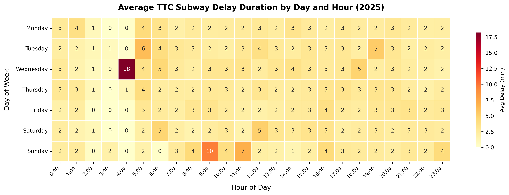

# Visualization 2: TTC Subway Delay Patterns by Day and Hour

## What software did you use to create your data visualization?

The data was processed in Python (pandas) and exported to a CSV pivot table. The final heatmap visualization was created in **Google Sheets** using its built-in conditional formatting and chart tools. A Python equivalent using **seaborn** is included in the appendix notebook (`assignment_3_code.ipynb`) for full reproducibility.

## Who is your intended audience?

The intended audience is the **general public and daily TTC commuters** who want practical guidance on which times of day and days of the week carry the highest risk of subway delays. This is also relevant to **urban planners** studying transit demand patterns.

## What information or message are you trying to convey with your visualization?

This heatmap shows the **average delay duration** (in minutes) for every combination of day of the week and hour of the day. The key message is that delay severity is not uniform — certain time slots (e.g., weekday rush hours, late-night periods) consistently experience longer average delays. Commuters can use this to make informed travel decisions.

## What aspects of design did you consider when making your visualization? How did you apply them?

- **Channel choice**: A heatmap maps a continuous variable (delay minutes) to color intensity, which is effective for spotting patterns across two categorical dimensions simultaneously (Few, 2012).
- **Sequential color scale**: The **YlOrRd** (yellow-orange-red) palette naturally conveys "low to high" and is accessible under most color vision deficiencies.
- **Annotations**: Numeric values are printed inside each cell so that precise values are readable even without interpreting color alone.
- **Grid lines**: White dividers between cells improve visual separation and prevent the chart from blurring into a single gradient.
- **Axis labels**: Hours are displayed in 24-hour format (`6:00`, `17:00`) for clarity, and days follow chronological Monday-to-Sunday order.

## How did you ensure that your data visualizations are reproducible?

The data processing pipeline (pivot table creation) is fully scripted in the Python notebook. The processed CSV (`delay_heatmap_data.csv`) is exported so the Google Sheets chart can be rebuilt by anyone. However, Google Sheets itself does not store reproducible "code" the way Python does — manual formatting steps (conditional coloring, cell sizing) are not version-controlled. To mitigate this, the Python seaborn equivalent in the appendix produces a near-identical chart that is fully reproducible.

## How did you ensure that your data visualization is accessible?

- The **YlOrRd** sequential palette avoids red-green conflicts and degrades gracefully under deuteranopia.
- Numeric annotations in each cell provide an alternative channel beyond color.
- Row and column labels use legible font sizes and standard terminology.
- The title includes the dataset name and year so the chart is interpretable out of context.

## Who are the individuals and communities who might be impacted by your visualization?

Shift workers, students, and caregivers who have less schedule flexibility may be disproportionately affected by delays at specific hours. Exposing these patterns empowers them to plan around peak-delay windows. Transit advocacy groups could also cite this data when pushing for more reliable off-peak or weekend service.

## How did you choose which features of your chosen dataset to include or exclude?

I used **day of week** and **hour** as dimensions because they capture the most actionable temporal patterns. I chose **average delay minutes** (rather than count or total) to normalize for varying ridership across time slots. Station and line were excluded to keep the visualization focused on temporal patterns rather than geographic ones.

## What 'underwater labour' contributed to your final data visualization product?

- Parsing inconsistent time formats from the raw CSV into usable hour values.
- Building and validating the pivot table to ensure all 7 × 24 cells were populated.
- Exporting the pivot data to CSV and manually formatting it in Google Sheets.
- Comparing the Google Sheets output with the Python seaborn version to ensure consistency.
- Adjusting color scale breakpoints so that the heatmap conveys meaningful differences rather than being dominated by outliers.
